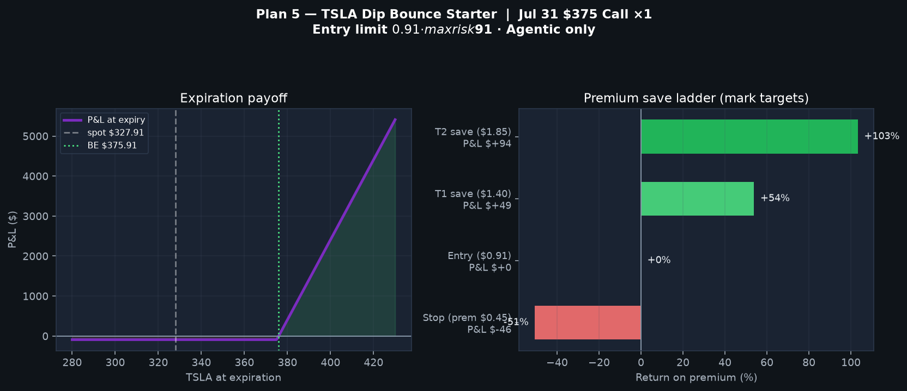

# Robinhood Agentic Trading

Integration with [Robinhood Agentic Trading](https://robinhood.com/us/en/agentic-trading/) via the official **Robinhood Trading MCP** server, plus an operational runbook for Grok-managed short-term plans, scheduled checks, and email reports.

Announced by [@RobinhoodApp](https://x.com/RobinhoodApp): *“Robinhood is now open to AI agents.”* Connect an AI agent through Model Context Protocol (MCP), open a dedicated Agentic account, and let the agent research, trade equities/options, and manage a portfolio on your behalf.

**Not financial advice.** Markets can go to zero. Only fund money you can afford to lose.

---

## Table of contents

1. [Local web portal](#local-web-portal)
2. [MCP endpoint](#mcp-endpoint)
3. [Setup (Grok Build TUI)](#setup-grok-build-tui)
4. [Account rules](#account-rules)
5. [Process & trade history](#process--trade-history)
6. [Plan 5 — TSLA Dip Bounce Starter (active)](#plan-5--tsla-dip-bounce-starter-active)
7. [Plan 1 — SMH semi pullback (closed @ T1)](#plan-1--smh-semi-pullback-closed--t1)
8. [Other attempts & research notes](#other-attempts--research-notes)
9. [Signal board](#signal-board-how-ideas-are-sourced)
10. [Scheduled tasks & email reports](#scheduled-tasks--email-reports)
11. [Manual checklist (minimal involvement)](#manual-checklist-minimal-involvement)
12. [Other platforms](#other-platforms)
13. [Safety notes](#safety-notes)
14. [Repo layout](#repo-layout)
15. [Links](#links)

---

## Local web portal

A **local dashboard + chat** lives in [`portal/`](portal/) so you can monitor the active plan and keep asking questions from the browser.

```bash
cd portal && ./run.sh
# → http://127.0.0.1:8787
```

| Feature | Detail |
|---|---|
| Dashboard | Live status from `portal/data/status.json` (Plan 5 TSLA option + levels) |
| Charts | Static PNGs under [`portal/static/charts/`](portal/static/charts/) |
| Chat | Local assistant; optional Grok via `XAI_API_KEY` |
| Queue | Messages in `portal/data/message_queue.json` for a Grok TUI session |
| Orders | **Not** placed from the portal — use Robinhood app or Grok MCP / Tasks |

Optional: copy `portal/.env.example` → `portal/.env` and set `XAI_API_KEY`. Details: [portal/README.md](portal/README.md).

---

## MCP endpoint

```
https://agent.robinhood.com/mcp/trading
```

| Capability | Status |
|---|---|
| Equities | Live |
| Options | Live (`option_level_2` on Agentic) |
| Crypto | Coming soon |
| Availability | Free for US-based Robinhood customers |

OAuth discovery (for debugging auth):

| Field | Value |
|---|---|
| Authorization | `https://robinhood.com/oauth` |
| Token | `https://api.robinhood.com/oauth2/token/` |
| Registration | `https://agent.robinhood.com/oauth/trading/register` |

---

## Setup (Grok Build TUI)

This repo includes project-scoped MCP config at [`.grok/config.toml`](.grok/config.toml). The same server may also be registered in user config (`~/.grok/config.toml`).

### 1. Authenticate (OAuth)

1. Run `/mcps` → select **robinhood-trading** → press **`i`**.
2. Complete OAuth and Agentic onboarding **on desktop**.
3. Verify: `grok mcp doctor robinhood-trading`.

Tokens live under `~/.grok/mcp_credentials.json`. **Do not commit credentials.**

### 2. Open & fund an Agentic account

| Capability | Scope |
|---|---|
| Read | Balances, positions, orders, watchlists |
| Write / trade | **Agentic account only** (`748082393`) |
| Options | Long calls/puts when `option_level_2+` |

### 3. Use tools from Grok

1. `search_tool` → query `"robinhood"` / `"trading"`.
2. `use_tool` → `robinhood-trading__<tool>`.
3. Prefer read-only unless the user asks to place/cancel orders.

---

## Account rules

| Rule | Detail |
|---|---|
| Trade only | **Agentic** account (`agentic_allowed=true`) |
| Never invent | Balances, fills, or P&amp;L — always pull live MCP data |
| Confirm | Large or ambiguous orders when intent is unclear |
| Options | Single-leg only via MCP (no multi-leg spreads yet) |
| Fractional | Dollar buys market + RTH; **stops fail on fractional equities** |

Agent rules: [AGENTS.md](AGENTS.md).

---

## Process & trade history

### Timeline

| When (UTC) | Event |
|---|---|
| 2026-07-20 | Repo initialized; Robinhood Trading MCP configured |
| 2026-07-20 | OAuth connected; Agentic funded (~**$100** cash) |
| 2026-07-20 | Research: X + Truth Social + live quotes + earnings calendar |
| 2026-07-20 | **Plan 1 executed**: buy **SMH** ~$70 market |
| 2026-07-20 | Fractional SMH stop-market **rejected** by broker |
| 2026-07-20 | Grok Tasks scheduled for manage + email reports |
| 2026-07-2x | **Plan 1 closed @ T1**: SMH sold ~**$585.35** (~**+$2.13**) |
| 2026-07-22 | Oil/Hormuz narrative; USO Jul 31 **$150c** limit **$1.00** placed |
| 2026-07-22/23 | USO ripped; ask &gt; limit → order **never filled** |
| 2026-07-23 | USO $150c order **cancelled**; book back to full cash |
| 2026-07-23 | Agentic upgraded to **`option_level_2`** |
| 2026-07-23 | Higher-risk option research + expected-return charts generated |
| 2026-07-23 | **Plan 5 executed**: **1× TSLA Jul 31 $375 call @ $0.90** |
| 2026-07-23 | Plan 5 save tasks armed (10 / 12 / 15 ET, email) |

### Trade ledger (Agentic)

| Plan | Instrument | Side | Entry | Exit | Result | Status |
|---|---|---|---:|---:|---:|---|
| **1** | SMH ~0.123 sh | Long equity | ~$568.07 ($70) | ~$585.35 | **~+$2.13** | **Closed @ T1** |
| — | USO Jul 31 $150c | Buy call limit $1.00 | — | — | $0 (never filled) | **Cancelled** |
| **5** | TSLA Jul 31 $375c ×1 | Long call | **$0.90** ($90) | — | Open (mark-to-market) | **Active** |

Starting capital ~**$100–102**. Only Agentic capital is used.

### Research artifacts (charts)

Generated for scenario analysis (not live fills):

| Chart | Path |
|---|---|
| Option P&amp;L curves | [`portal/static/charts/expected_returns_pnl_curves.png`](portal/static/charts/expected_returns_pnl_curves.png) |
| Scenario return bars | [`portal/static/charts/expected_returns_scenarios.png`](portal/static/charts/expected_returns_scenarios.png) |
| Scenario table | [`portal/static/charts/expected_returns_table.png`](portal/static/charts/expected_returns_table.png) |
| Thesis payoff ladder | [`portal/static/charts/expected_returns_thesis_ladder.png`](portal/static/charts/expected_returns_thesis_ladder.png) |
| **Plan 5 payoff + saves** | [`portal/static/charts/plan5_tsla_bounce.png`](portal/static/charts/plan5_tsla_bounce.png) |

---

## Plan 5 — TSLA Dip Bounce Starter (**active**)

Full runbook: [`strategies/plan5-tsla-bounce.md`](strategies/plan5-tsla-bounce.md)

### Chart



### Thesis

TSLA sold off hard (~**−12%** vs prior close ~$374 → spot ~$328 on entry day). Defined-risk **OTM call** to catch a short-term relief bounce, with mechanical **premium save levels** so the ~$100 book is not held blind into expiry.

Hands-off mode: agent + Grok Tasks manage exits; user primarily reads email.

### Entry (executed 2026-07-23)

| Field | Value |
|---|---|
| Account | Agentic `748082393` |
| Strategy | Long call (Level 2) |
| Contract | **TSLA Jul 31 2026 $375 Call** |
| Qty | **1** |
| Limit | $0.91 |
| **Fill** | **$0.90** @ `2026-07-23T13:57:58Z` |
| Debit | **$90.00** (+ ~$0.04 fees) |
| Order id | `6a621de6-3d96-46f6-ab57-1b99d497c532` |
| Option id | `53c52a9d-bdb7-42c2-88eb-b46976caf14b` |
| Spot at entry | ~$327.91 |
| Break-even @ expiry | **$375.90** |
| Cash left after fill | ~**$12** |
| Opening mark (shortly after) | ~$0.86–0.90 (near flat / small red) |

### Save ladder (premium mark)

| Level | Premium | Est. P&amp;L vs $0.90 | Action |
|---|---:|---:|---|
| **Stop** | **$0.45** | −$45 (−50%) | Sell-to-close full |
| **T1** | **$1.40** | +$50 (~+56%) | Sell-to-close full (primary bank) |
| **T2** | **$1.85** | +$95 (~+106%) | Sell-to-close if still open |
| Stock hard | TSLA **&lt; $310** | — | Prefer exit |
| Time stop | **2026-07-30 15:00 ET** | — | Close before last full day |

With **1 contract**, every save is a **full close** (no scale-out). No average-down.

### Why this contract

| Alternative | Why not |
|---|---|
| 1 share TSLA | ~$328 — full book, no options leverage |
| Jul 31 $340–360c | Debit $180–$535 — over buying power |
| Jul 31 $380–400c | Cheaper but further OTM / lower delta |
| **Jul 31 $375c** | Closest liquid strike fitting ≤ $100 with tight bid/ask |

### Expiry payoff (mechanical)

| TSLA @ expiry | Intrinsic | P&amp;L |
|---:|---:|---:|
| ≤ $375 | $0 | **−$90** |
| $376 | $100 | +$10 |
| $380 | $500 | +$410 |
| $400 | $2,500 | +$2,410 |

Realistic wins are usually **mid-path premium spikes** (T1/T2), not waiting for deep ITM at expiry. Model `chance_of_profit_long` at entry was ~**6%** (lottery-style structure with rules).

### Monitor tasks (Plan 5)

| Name | Cadence (ET) | Task id (approx) |
|---|---|---|
| `plan5-tsla-open-10et` | Weekdays **10:00** | `cb65d6a8-da84-4210-b2e2-46ec40fb1a41` |
| `plan5-tsla-midday-12et` | Weekdays **12:00** | `582d9b82-757e-494d-8413-572ae07d28f9` |
| `plan5-tsla-powerhour-15et` | Weekdays **15:00** | `14f6c592-cfee-4bf6-9d90-e0852130d11b` |

Email: **sawaiz@sawaizsyed.com**. Each run: quote position → sell-to-close if stop/T1/T2/time hit → short report.

Live snapshot also in [`portal/data/status.json`](portal/data/status.json).

---

## Plan 1 — SMH semi pullback (**closed @ T1**)

### Thesis

Late-week semiconductor washout + AI/compute demand → mean-reversion bounce. **SMH** used as diversified vehicle vs chasing single-name MU/SNDK after large green opens.

### Entry (executed 2026-07-20)

| Field | Value |
|---|---|
| Symbol | **SMH** |
| Side | Buy |
| Type | Market · GFD · regular hours |
| Notional | **$70.00** |
| Quantity | **0.123224** shares |
| Avg fill | **$568.0699** |
| Order id | `6a5e499f-a510-43ca-be9c-8d444d3718ad` |
| Cash remaining after | ~**$30** |

Ideal zone was **$555–562**; live ~$568 forced a market dollar buy (fractional cannot rest a limit the same way).

### Management levels (used)

| Level | Price | Action |
|---|---:|---|
| Hard stop | **$536** | Sell full (task-enforced; fractional stop rejected) |
| **T1** | **$585–600** | Sell full |
| T2 | **$620** | Stretch (not needed) |

### Exit (closed)

| Field | Value |
|---|---|
| Exit | Sell near **T1** ~**$585.35** |
| Approx. P&amp;L | **~+$2.13** on the $70 slice |
| Status | **Closed** — book returned to cash before options work |

### Why no resting stop

Robinhood MCP rejected fractional SMH stop-market (`Invalid trigger for fractional order`). Stops ran via **Grok Tasks + app awareness**, not a GTC stop on the book.

---

## Other attempts & research notes

### USO Jul 31 $150 call (cancelled, never filled)

| Field | Value |
|---|---|
| Thesis | Oil / Hormuz supply-risk continuation |
| Order | Buy 1× USO Jul 31 **$150c** limit **$1.00** |
| Order id | `6a61c434-3786-4cdd-87f3-f641846ce2c1` |
| Outcome | **Unfilled** — oil spiked; ask moved to ~$2.75+ |
| Action | **Cancelled** 2026-07-23; cash freed |
| Lesson | Stale cheap limits miss fast geopolitical moves; next oil idea needed live ask ≤ BP |

### Higher-risk scan (not all traded)

After USO cancel, live candidates sized to ~$100 included:

| Idea | Fit BP? | Notes |
|---|---|---|
| USO Jul 31 $165–170c | Yes | Direct oil lottery; high IV |
| UVXY Jul 31 OTM calls | Yes | Vol; wide spreads / decay risk |
| XLE Jul 31 $62c | Yes | Energy lag catch-up, cleaner than USO 150s |
| TSLA Jul 31 $375–380c | Yes | **Selected as Plan 5** |
| XLE equity Plan 4 | Yes | Lower risk alternative (not armed) |

Scenario charts for that scan are under [`portal/static/charts/`](portal/static/charts/) (`expected_returns_*.png`).

---

## Signal board (how ideas are sourced)

Plans are ranked from **social + live market + calendar**, not tip spam.

### Themes (Jul 2026 week)

| Theme | Sources | Vehicles | Reliability note |
|---|---|---|---|
| Semi / memory bounce | X (SMH, MU, SNDK, NVDA, AMD) | SMH, NVDA, MU | High consensus; avoid FOMO after +5–7% days |
| Energy / Hormuz | X + macro | XLE, USO, XOM | Two-sided; de-escalation headlines crush oil |
| Mega-cap dump / bounce | Tape + X | TSLA, GOOGL | Prefer defined-risk options on ~$100 book |
| Truth Social | News/history | Macro / oil / names | Headline risk, not alpha |

### Sketch board (status)

| Id | Idea | Status |
|---|---|---|
| Plan 1 | SMH semi pullback | **Closed @ T1** |
| Plan 2 | MU satellite | Not armed |
| Plan 3 | GOOGL reaction | Watch only |
| Plan 4 | XLE equity lag | Sketched, not armed |
| **Plan 5** | **TSLA dip bounce call** | **Active** |
| — | USO 150c | Cancelled unfilled |

---

## Scheduled tasks & email reports

Grok **Tasks** notify via email. Target address:

**sawaiz@sawaizsyed.com**

> Delivery uses the notification email on the **Grok / xAI account**. Ensure it receives (or forwards to) that address.

### Active tasks (Plan 5)

| Name | Cadence (America/New_York) | Purpose |
|---|---|---|
| `plan5-tsla-open-10et` | Weekdays **10:00** | Quote + auto-exit on stop/T1/T2/time |
| `plan5-tsla-midday-12et` | Weekdays **12:00** | Save-level watch |
| `plan5-tsla-powerhour-15et` | Weekdays **15:00** | Power hour + overnight note |

### Auto-actions (Plan 5)

1. Load Agentic portfolio + option position (live MCP only).
2. If option mark **≤ $0.45** or **≥ $1.40** or **≥ $1.85**, or time stop: **sell-to-close** 1 contract.
3. Else hold and email short status (TSLA, mark, P&amp;L vs $0.90, distance to levels).
4. Never trade non-Agentic accounts. Never average down without a new plan.

### Legacy Plan 1 tasks

Plan 1 SMH tasks may still exist from earlier setup; they are **obsolete** once SMH is flat. Prefer pause/archive via `tasks__list` / `tasks__pause` if they still fire.

### Cadence limits

| Wanted | Reality |
|---|---|
| True price webhooks | **Not** available via Robinhood MCP |
| Hourly Tasks RRULE | **Not** supported (daily/weekly style only) |
| Level coverage | **3× per weekday** (10 / 12 / 15 ET) |

---

## Manual checklist (minimal involvement)

Default mode for Plan 5: **hands off**.

| Do | Don’t |
|---|---|
| Read Grok Task emails if you want updates | Watch the chart all day |
| Open Robinhood only on unexpected trade pushes | Average down / add size |
| Optional: glance at account value once a day | Move money mid-trade |

### Only intervene if

- No task emails for a full trading day after markets are open  
- Unexpected fill / order you don’t recognize  
- You want an immediate **flatten** (ask agent: “sell Plan 5 now”)

### Session prompts (copy-paste)

```text
Plan 5 check — act if stop 0.45 / T1 1.40 / T2 1.85 / time stop. Email sawaiz@sawaizsyed.com.
```

```text
Flatten Plan 5 — sell-to-close TSLA Jul31 375c if still open. Confirm fill.
```

### After flat

1. Pause Plan 5 tasks.  
2. Journal entry/exit/reason in history above.  
3. Arm a new plan only on explicit request.

---

## Other platforms

Same MCP URL works elsewhere:

| Platform | How to connect |
|---|---|
| **Claude Code** | `claude mcp add robinhood-trading --transport http https://agent.robinhood.com/mcp/trading` |
| **Claude Desktop** | Settings → Connectors → Add custom connector → paste MCP URL |
| **ChatGPT** | Developer Mode → Settings → Apps → Create app → paste MCP URL |
| **Codex CLI** | `codex mcp add robinhood-trading --url https://agent.robinhood.com/mcp/trading` |
| **Cursor** | Settings → Tools & MCPs → Connect → paste MCP URL |
| **Grok (web)** | + → Add connector → Custom → paste MCP URL |

Scheduled Tasks + email in this runbook are **Grok-specific**.

---

## Safety notes

- Agentic trading involves significant risk, including possible loss of principal.
- AI agents can misinterpret instructions or act on incomplete data.
- Robinhood does not control or audit third-party AI agents.
- Prefer small funded balances; review activity in the app regularly.
- Social media (X, Truth Social) is narrative/risk context, not alpha.
- Long options can go to **$0**; Plan 5 max loss ≈ **$90** premium.
- Automated exits can miss gaps; optional app alerts on TSLA / option mark help.
- Full disclosures: [Robinhood newsroom](https://robinhood.com/us/en/newsroom/robinhood-is-now-open-to-agents/).

---

## Repo layout

```
.grok/config.toml              # Project-scoped MCP server definition
AGENTS.md                      # Agent safety / MCP usage rules
README.md                      # This runbook (history + active plan)
strategies/
  plan5-tsla-bounce.md         # Plan 5 full runbook
portal/                        # Local web dashboard + chat
  app.py
  run.sh
  data/status.json             # Live plan snapshot
  static/charts/               # Payoff & scenario PNGs
    plan5_tsla_bounce.png
    expected_returns_*.png
  README.md
.gitignore
```

**Never commit:** OAuth tokens, `mcp_credentials.json`, API keys, `.env`, or secrets.

---

## Links

- [Agentic Trading product page](https://robinhood.com/us/en/agentic-trading/)
- [Connect your AI agent](https://robinhood.com/us/en/support/articles/agentic-trading-overview/#ConnectyourAIagent)
- [Trading with your agent](https://robinhood.com/us/en/support/articles/trading-with-your-agent/)
- [Agentic Trading overview](https://robinhood.com/us/en/support/articles/agentic-trading-overview/)
- [MCP docs (Grok TUI)](https://docs.x.ai/) — local: `~/.grok/docs/user-guide/07-mcp-servers.md`
- Background tasks: `~/.grok/docs/user-guide/20-background-tasks.md`
