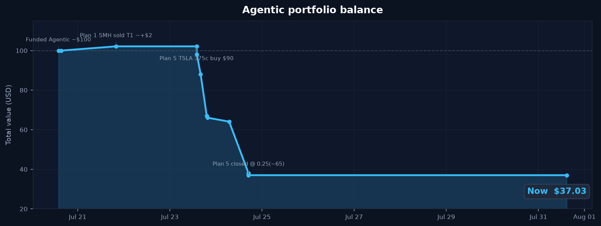

# Robinhood Agentic Trading

Short-term trades on a dedicated **Agentic** account via the [Robinhood Trading MCP](https://agent.robinhood.com/mcp/trading). Managed in Grok with email checks.

**Not financial advice.** You can lose the whole book.

---

## Portfolio balance



| | |
|---|---:|
| Start (≈ Jul 20) | **~$100** |
| Now (cash) | **~$37.03** |
| Net | **~−$63** |

Data: [`portal/data/portfolio_history.json`](portal/data/portfolio_history.json)

---

## Trade ledger

| Plan | What | Result | Status |
|---|---|---:|---|
| **1** | SMH long ~$70 | **~+$2** @ T1 | Closed |
| — | USO Jul 31 $150c limit $1 | $0 | Cancelled (never filled) |
| **5** | TSLA Jul 31 $375c @ $0.90 → sold $0.25 | **−$65** | Closed (stop) |
| **6** | XLE long **$32** equity | — | **Blocked — profile** |

---

## Plan 6 — XLE energy equity (**ready · not filled**)

Safer rebuild after Plan 5: **fractional XLE**, not options.

| Field | Value |
|---|---|
| Account | Agentic `748082393` |
| Symbol | **XLE** |
| Side | Buy market **$32** (RTH) |
| Spot (design) | ~**$58.84** |
| Cash left | ~**$5** buffer |
| Stop | **$55.50** (~−5.5%) |
| T1 | **$62.00** (~+5%) |
| T2 | **$64.00** (~+9%) |

**Thesis:** Diversified energy (vs USO single-name lottery). Oil still elevated; XLE lagged pure crude earlier in the cycle. Equity caps loss better than OTM calls on a ~$37 book.

### Cannot place yet

Robinhood blocked the second trade until the investor profile is complete:

**[Complete investor profile](https://applink.robinhood.com/investment_profile?account_number=748082393&context=second_trade)**

After that, say: *“execute Plan 6”* — agent reviews + places $32 XLE market buy.

Runbook: [`strategies/plan6-xle-equity.md`](strategies/plan6-xle-equity.md)

---

## Closed plans (short)

### Plan 1 — SMH (closed +)
- Buy ~0.123 sh @ ~$568 · sell ~$585 T1 · **~+$2**

### Plan 5 — TSLA $375c (closed −)
- Long 1× Jul 31 2026 **$375 call** @ **$0.90**
- Stop $0.45 / stock hard $310 / T1 $1.40
- Exit **2026-07-24** sell-to-close @ **$0.25** · **−$65**
- Details: [`strategies/plan5-tsla-bounce.md`](strategies/plan5-tsla-bounce.md)

---

## Setup (once)

1. `/mcps` → **robinhood-trading** → `i` (OAuth)
2. Agentic account only for trades
3. Complete [investor profile](https://applink.robinhood.com/investment_profile?account_number=748082393&context=second_trade) before trade #2+
4. Options need `option_level_2+` (already used)

MCP: `https://agent.robinhood.com/mcp/trading`

---

## Portal

```bash
cd portal && ./run.sh   # http://127.0.0.1:8787
```

- Balance chart at top
- Live status: `portal/data/status.json`
- Chat optional (`XAI_API_KEY`)

---

## Rules

| Do | Don’t |
|---|---|
| Trade **Agentic only** | Invent balances / fills |
| Prefer equity on tiny book | Blind OTM options after Plan 5 |
| Email: sawaiz@sawaizsyed.com | Commit tokens / `.env` |

---

## Repo

```
README.md
AGENTS.md
strategies/plan5-tsla-bounce.md
strategies/plan6-xle-equity.md
portal/
  data/status.json
  data/portfolio_history.json
  static/charts/portfolio_balance.png
```
